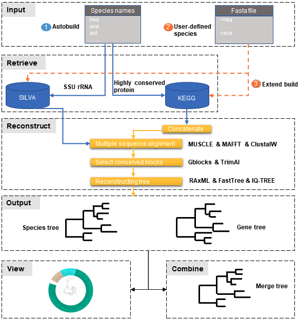

# PhySpeTree: one command line automatically reconstruct phylogenetic tree


## Introduction

In some filed combine phylogenetic species tree do some prediction are very important. for instance,
protein-protein interactions and gene pathway members predictions. In this predicted reconstructed a exact species tree
is necessary, but the process of reconstructing the species or gene tree is very tedious.

Here we developing a command line software **PhySpeTree**, which only one command line to reconstruct phylogenetic tree. The users only need provide a txt files, witch contain species names only
(the species names must be abbreviated names are same with **KEGG database** organisms abbreviations). Then automatically reconstruct phylogenetic tree by **PhySpeTree**.


## PhySpeTree workflow





PhySpeTree workflow includes the following steps:

1. Prepare the abbreviation names of species to reconstruct phylogenetic tree, for example: [species abbreviated names][1]

2. Choice the method to reconstruct phylogenetic tree (16s SSU rRNA method or Highly conserved proteins method).

3. Query database and parse retrieved 16S rRNA sequences or highly conserved proteins (FASTA format).

4. Multiple sequence alignment by Muscle or ClustalW.

5. Concatenate highly conserved proteins by PhySpeTree.

6. Select conserved blocks by Gblosks.

7. Reconstructing phylogenetic tree by RAxML or FastTree.

8. Output reconstructed phylogenetic tree files.


## Features

- Easy to use (one command line auto construct phylogenetic tree).

- Multi-selection (selection construct phylogenetic tree by highly conversion protein or 16s RNA).

- Adjustable parameters (user can choice any enable parameters by own).

- User need provide a species list (reconstruct phylogenetic tree organisms) only.

- combine best phylogenetic tree (combine multiple tree to a consensus tree)

- view tree by iTol (easy use iview module to view tree)


## PhySpeTree module:

* [autobuild](usage.md#autobuild): Auto reconstruct phylogenetic tree

```bash
PhySpeTree autobuild -i species_name_list.txt -o Output
```


* [build](usage.md#build): Reconstruct phylogenetic tree

```bash
PhySpeTree build -i species.fasta -o Output
```

* [combine](usage.md#combine): Combine multiple best phylogenetic tree 

```bash
PhySpeTree combine -i multiple_tree.tree -o Output
```


* [iview](usage.md#iview): view phylogenetic tree by iTol

```bash
PhySpeTree iview -i species_name_list.txt -o ivew -range phylum 
```

* [check](usage.md#check):Check organisms for extend phylogenetic tree 

```
PhySpeTree check -i organisms.txt -o checkout --protein
```


[1]: example/organism_example_list.txt