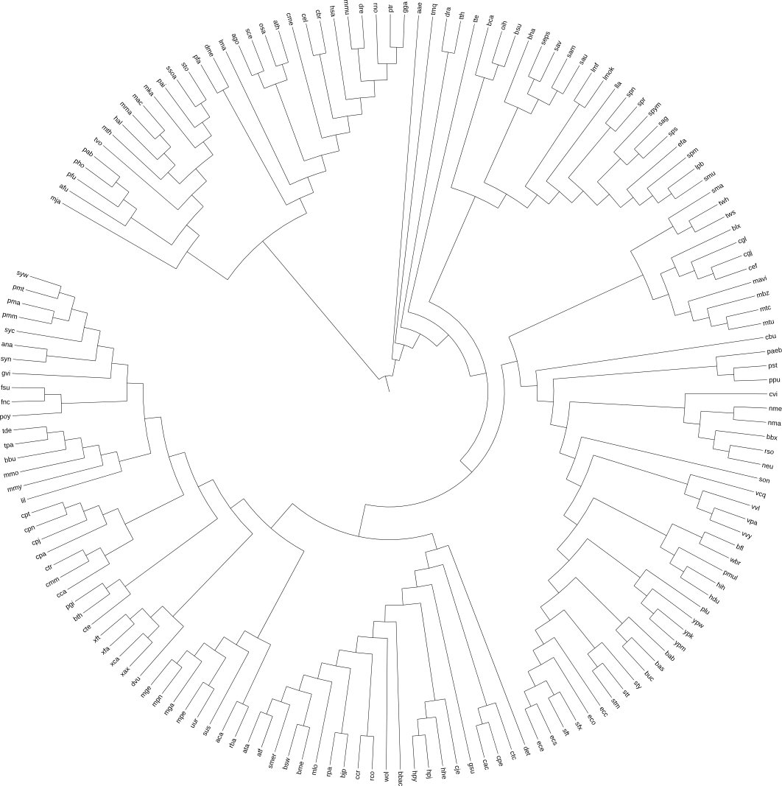
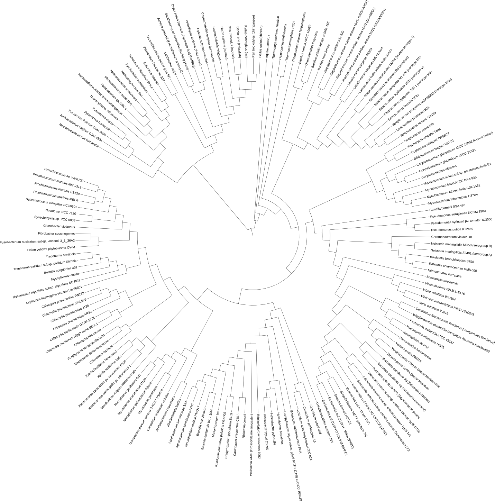
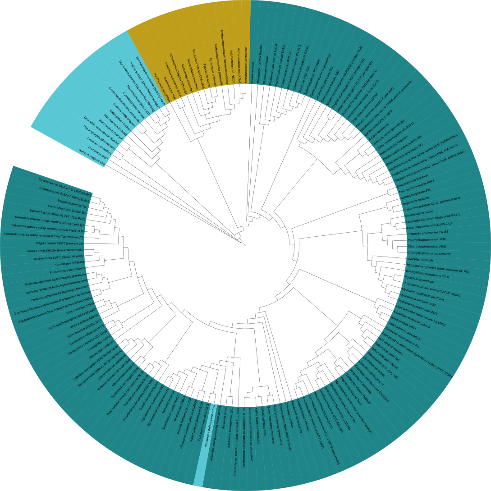
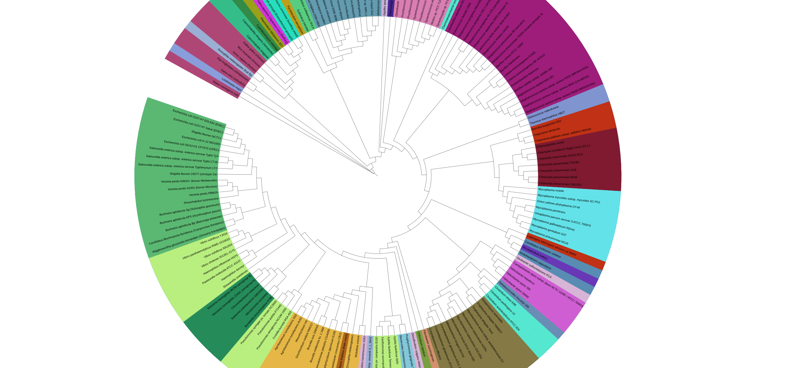

# Physpe Tutorial 

## Auto bulid Tree of life


### Auto build Tree of life by highly conserved protein

None


### Auto build Tree of life by 16s SSU RNA

####  Prepare organism names list, 191 organisms names list [download][1]  

```bash
$ cat 191speciesnames.txt 
neq
pai
ape
sto
ssoa
tvo
tac
afu
.....
```

####  Reconstruct phylogenetic tree by 16s SSU RNA  

```
$ physpe autobuild -i 191speciesnames.txt -o 191_rna --srna
Loading organisms names success.....

The result are store in:191_rna

Now loading data and constructing species phylogenetic tree......
2016-09-05 19:48:03,824 Checking organisms INFO: The organism: neq
2016-09-05 19:48:03,824 Checking organisms INFO: The organism: ape
2016-09-05 19:48:03,824 Checking organisms INFO: The organism: tac
2016-09-05 19:48:03,824 Checking organisms INFO: The organism: mmp
2016-09-05 19:48:03,824 Checking organisms INFO: The organism: gla
2016-09-05 19:48:03,824 Checking organisms INFO: The organism: tps
2016-09-05 19:48:03,824 Checking organisms INFO: The organism: cho
2016-09-05 19:48:03,824 Checking organisms INFO: The organism: ddi
2016-09-05 19:48:03,824 Checking organisms INFO: The organism: spo
2016-09-05 19:48:03,824 Checking organisms INFO: The organism: aga
2016-09-05 19:48:03,824 Checking organisms INFO: The organism: tru
2016-09-05 19:48:03,824 Checking organisms INFO: The organism: mpu
2016-09-05 19:48:03,824 Checking organisms INFO: The organism: lin
2016-09-05 19:48:03,825 Checking organisms INFO: The organism: ban
2016-09-05 19:48:03,825 Checking organisms INFO: The organism: bce
2016-09-05 19:48:03,825 Checking organisms INFO: The organism: ljo
2016-09-05 19:48:03,825 Checking organisms INFO: The organism: san
2016-09-05 19:48:03,825 Checking organisms INFO: The organism: spg
2016-09-05 19:48:03,825 Checking organisms INFO: The organism: ges
2016-09-05 19:48:03,825 Checking organisms INFO: The organism: lis
2016-09-05 19:48:03,825 Checking organisms INFO: The organism: sco
2016-09-05 19:48:03,825 Checking organisms INFO: The organism: cdi
2016-09-05 19:48:03,825 Checking organisms INFO: The organism: mle
2016-09-05 19:48:03,825 Checking organisms INFO: The organism: wsu
2016-09-05 19:48:03,825 Checking organisms INFO: The organism: rpr
2016-09-05 19:48:03,825 Checking organisms INFO: The organism: bpe
2016-09-05 19:48:03,825 Checking organisms INFO: The organism: bpa
2016-09-05 19:48:03,825 Checking organisms INFO: The organism: ppr
2016-09-05 19:48:03,825 Checking organisms WARNING: There organisms can't match in SILVA database so removed and reconstruct phylogenetic tree
2016-09-05 19:48:03,825 16s DB INFO: Read organisms names success
2016-09-05 19:48:14,354 16s DB INFO: Retrieve organism 'pai' 16s SSU RNA sequences data success
2016-09-05 19:48:17,703 16s DB INFO: Retrieve organism 'sto' 16s SSU RNA sequences data success
2016-09-05 19:48:20,674 16s DB INFO: Retrieve organism 'ssoa' 16s SSU RNA sequences data success
2016-09-05 19:48:23,031 16s DB INFO: Retrieve organism 'tvo' 16s SSU RNA sequences data success
2016-09-05 19:48:26,510 16s DB INFO: Retrieve organism 'afu' 16s SSU RNA sequences data success
2016-09-05 19:48:28,766 16s DB INFO: Retrieve organism 'hal' 16s SSU RNA sequences data success
2016-09-05 19:48:31,148 16s DB INFO: Retrieve organism 'mac' 16s SSU RNA sequences data success
2016-09-05 19:48:33,579 16s DB INFO: Retrieve organism 'mma' 16s SSU RNA sequences data success
2016-09-05 19:48:35,856 16s DB INFO: Retrieve organism 'pfu' 16s SSU RNA sequences data success
2016-09-05 19:48:38,194 16s DB INFO: Retrieve organism 'pho' 16s SSU RNA sequences data success
......
```

#### Get the tree file  




#### Use iview annotating tree

* Change label names use `--labels`

```
$ physpe iview -i 191speciesnames.txt --labels
Change abbreviation names to full names complete
change labels file was save in iview/labels.txt

$ cd iview

$ cat labels.txt 
LABELS
SEPARATOR TAB
DATA
neq     Nanoarchaeum equitans
pai     Pyrobaculum aerophilum
ape     Aeropyrum pernix
sto     Sulfolobus tokodaii
ssoa    Sulfolobus solfataricus SULA
tvo     Thermoplasma volcanium
tac     Thermoplasma acidophilum
afu     Archaeoglobus fulgidus DSM 4304
hal     Halobacterium sp. NRC-1
mac     Methanosarcina acetivorans
mma     Methanosarcina mazei Go1
pfu     Pyrococcus furiosus DSM 3638
pho     Pyrococcus horikoshii
pab     Pyrococcus abyssi
mth     Methanothermobacter thermautotrophicus
mka     Methanopyrus kandleri
mmp     Methanococcus maripaludis S2
.....
```

* Tree view in iTol




* Color range by phylum

```
$ physpe iview -i 191speciesnames.txt -o iview --range -a phylum
Color range by phylum was complete.
Color range annotation was save in iview/range_color_by_phylum.txt

$ cd iview

$ cat range_color_by_phylum.txt 
TREE_COLORS
SEPARATOR TAB
DATA
neq     range   #996433 Archaea
pai     range   #996433 Archaea
ape     range   #996433 Archaea
sto     range   #996433 Archaea
ssoa    range   #996433 Archaea
tvo     range   #996433 Archaea
tac     range   #996433 Archaea
afu     range   #996433 Archaea
hal     range   #996433 Archaea
mac     range   #996433 Archaea
mma     range   #996433 Archaea
pfu     range   #996433 Archaea
pho     range   #996433 Archaea
pab     range   #996433 Archaea
mth     range   #996433 Archaea
mka     range   #996433 Archaea
mmp     range   #996433 Archaea
mja     range   #996433 Archaea
.....
```

* Tree view in iTol




* Color range by class

```
$ physpe iview -i 191speciesnames.txt --range -a class
Color range by class was complete.
Color range annotation was save in iview/range_color_by_class.txt

$ cd iview

$ cat range_color_by_class.txt 
TREE_COLORS
SEPARATOR TAB
DATA
neq     range   #4A959E Nanoarchaeota
pai     range   #58CD80 Crenarchaeota
ape     range   #58CD80 Crenarchaeota
sto     range   #58CD80 Crenarchaeota
ssoa    range   #58CD80 Crenarchaeota
tvo     range   #639BB0 Euryarchaeota
tac     range   #639BB0 Euryarchaeota
afu     range   #639BB0 Euryarchaeota
hal     range   #639BB0 Euryarchaeota
mac     range   #639BB0 Euryarchaeota
mma     range   #639BB0 Euryarchaeota
pfu     range   #639BB0 Euryarchaeota
pho     range   #639BB0 Euryarchaeota
pab     range   #639BB0 Euryarchaeota
mth     range   #639BB0 Euryarchaeota
mka     range   #639BB0 Euryarchaeota
mmp     range   #639BB0 Euryarchaeota
mja     range   #639BB0 Euryarchaeota
gla     range   #C5D49E Diplomonads
lma     range   #899DDB Euglenozoa
tps     range   #7DD2ED Stramenopiles
cho     range   #99A01A Alveolates
.....
```

* Tree view in iTol




[1]: example/191speciesnames.txt