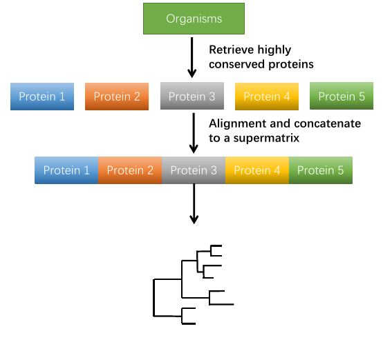
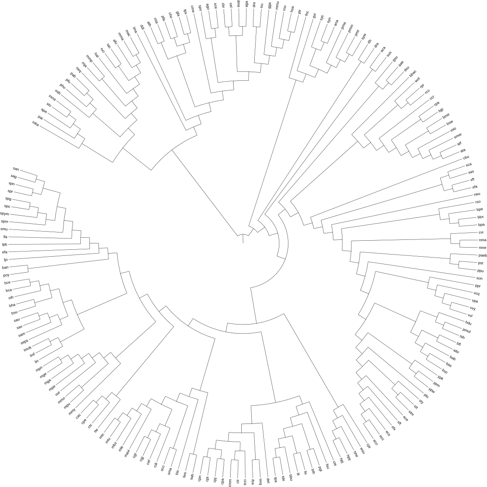
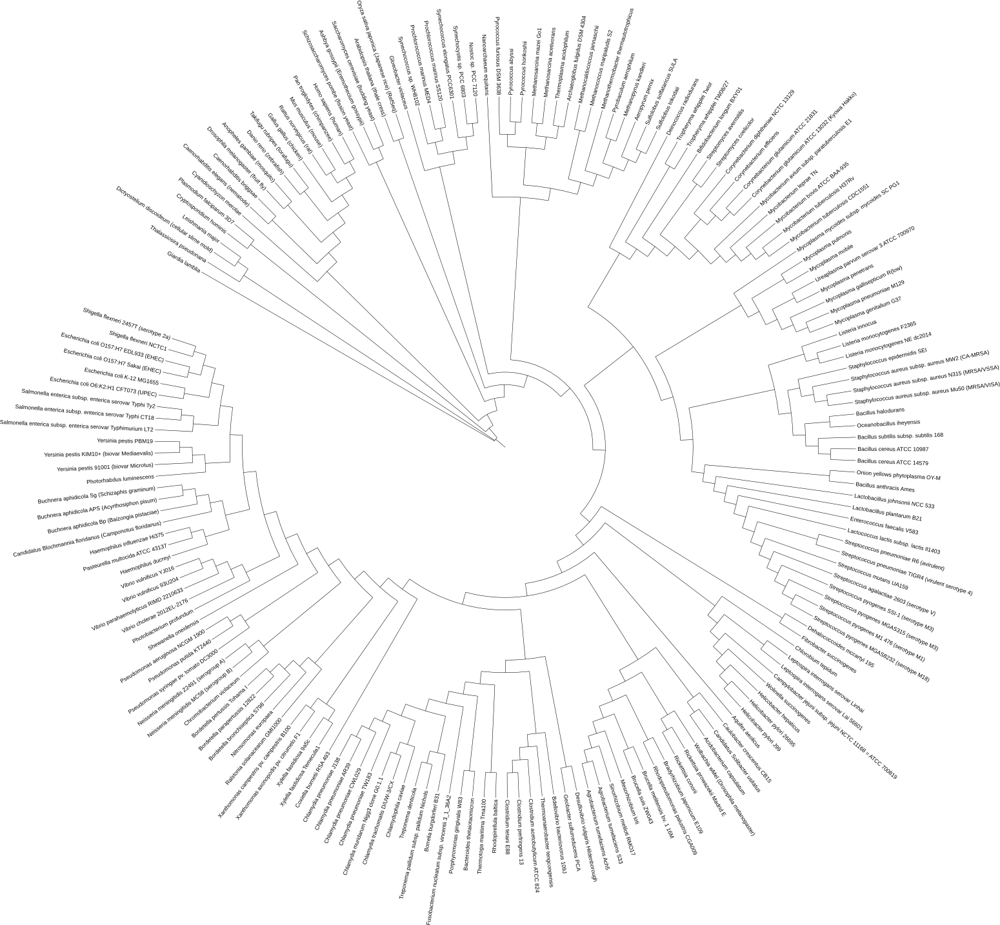
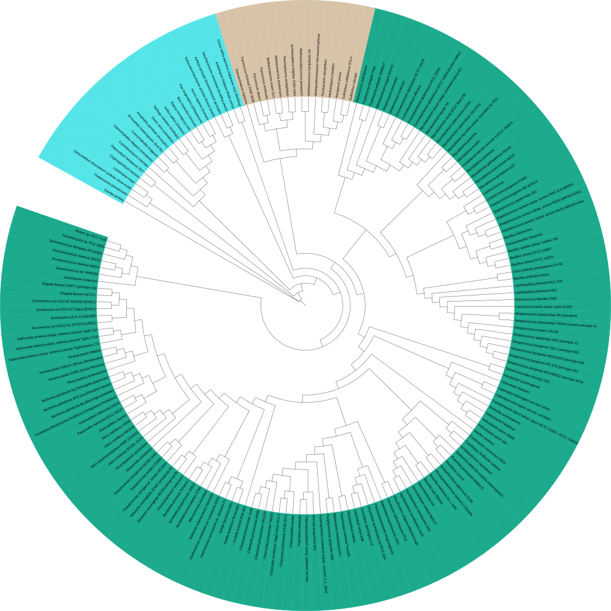
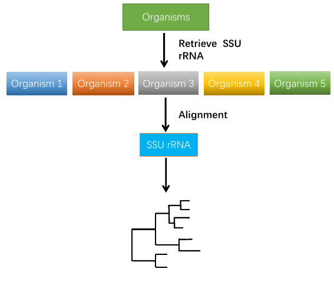
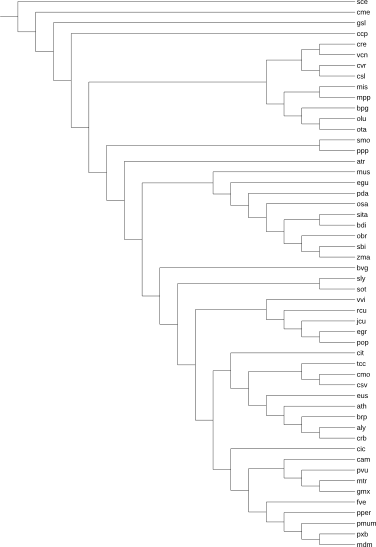
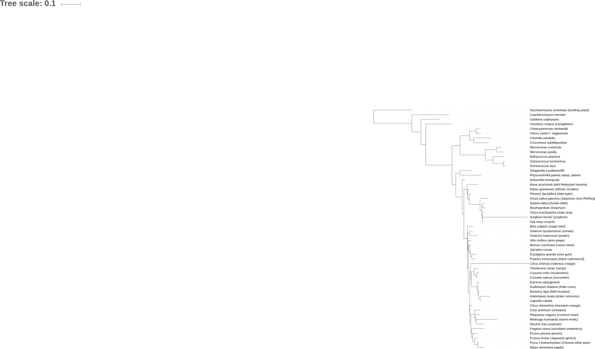
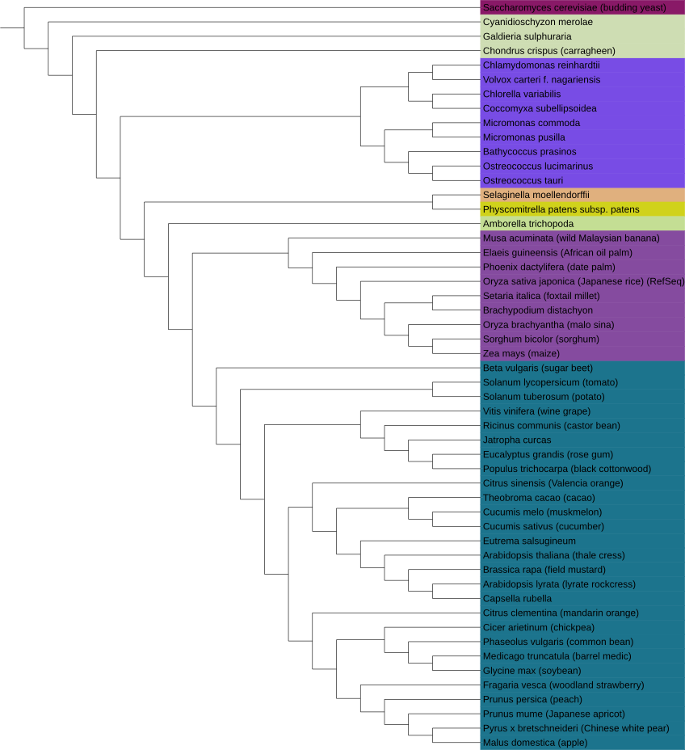
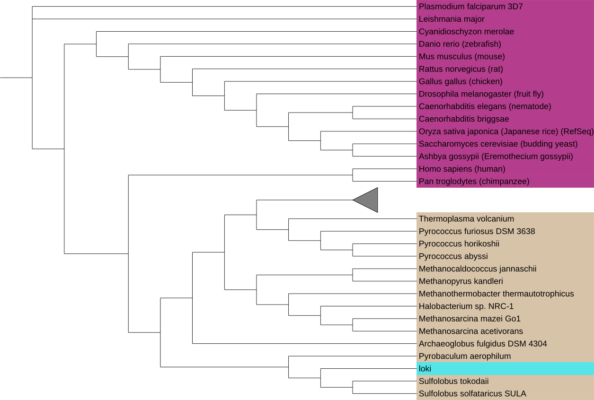
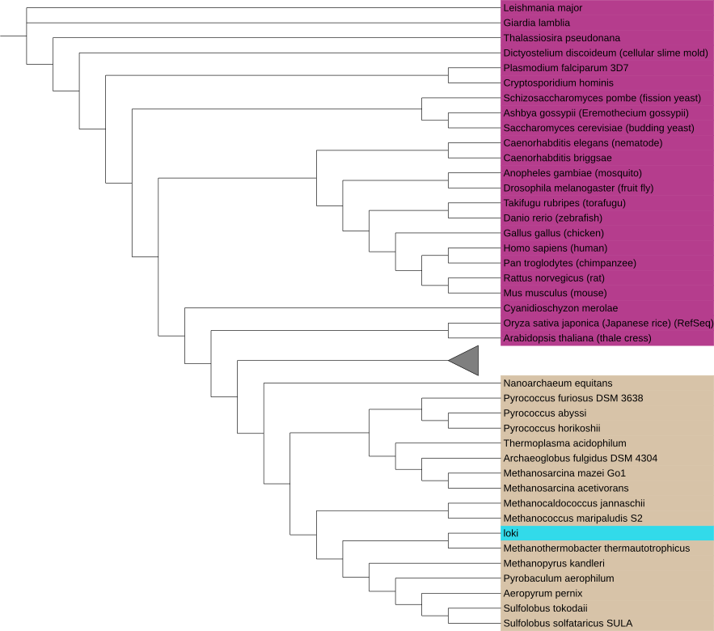

# PhySpeTree Tutorial 

## Automatically reconstruct the tree-of-life

Here we show how to use PhySpeTree to reconstruct tree-of-life (191 organisms) by two methods (HCP and SSU rRNA).

### Reconstruct the tree-of-life by the HCP method

**Concept**



The main concept of the HCP method is to concatenate highly conserved proteins into a supermatrix and then build species tree. Here we prepared [31 classes of HCP](faq.md#Physpe_reconstruct_phylogenetic_tree_database) to build the tree.

####  1. Prepare input species

Download 191 [KEGG][2] abbreviated species names:

```bash
$ wget "https://xiaofeiyangyang.github.io/physpetools/example/191speciesnames.txt"

--2016-10-30 15:26:06--  https://xiaofeiyangyang.github.io/physpetools/example/191speciesnames.txt
Resolving xiaofeiyangyang.github.io (xiaofeiyangyang.github.io)... 151.101.48.133
Connecting to xiaofeiyangyang.github.io (xiaofeiyangyang.github.io)|151.101.48.133|:443... connected.
HTTP request sent, awaiting response... 200 OK
Length: 773 [text/plain]
Saving to: ‘191speciesnames.txt’

191speciesnames.txt          100%[==============================================>]     773  --.-KB/s    in 0s      

$ cat 191speciesnames.txt 
neq
pai
ape
sto
ssoa
tvo
tac
afu
.....
```

####  2. Reconstruct the species tree

Use `--hcp` option to specify the HCP method.

```
$ PhySpeTree autobuild -i 191speciesnames.txt -o 191_pro --hcp

Loading organisms names success.....

The result are store in:191_pro

Now loading data and constructing phylogenetic tree......
2016-10-30 15:32:07,894 Checking organisms INFO: The species: ges can't match in KEGG protein index database
2016-10-30 15:32:07,894 Checking organisms WARNING: These species can't match in KEGG protein index database so removed and reconstruct phylogenetic tree.
2016-10-30 15:32:07,894 KEGG INDEX DB INFO: Read organisms names success
2016-10-30 15:32:34,213 KEGG INDEX DB INFO: Retrieve and download of highly conserved protein 'Ribosomal protein L1' was successful store in p1.fasta file
2016-10-30 15:33:00,679 KEGG INDEX DB INFO: Retrieve and download of highly conserved protein 'Leucyl-tRNA synthetase' was successful store in p2.fasta file
2016-10-30 15:33:25,052 KEGG INDEX DB INFO: Retrieve and download of highly conserved protein 'Ribosomal protein L14' was successful store in p3.fasta file
2016-10-30 15:33:49,649 KEGG INDEX DB INFO: Retrieve and download of highly conserved protein 'Ribosomal protein L5' was successful store in p4.fasta file
2016-10-30 15:34:14,510 KEGG INDEX DB INFO: Retrieve and download of highly conserved protein 'Ribosomal protein S7' was successful store in p5.fasta file
2016-10-30 15:34:41,123 KEGG INDEX DB INFO: Retrieve and download of highly conserved protein 'Arginyl-tRNA synthetase' was successful store in p6.fasta file
2016-10-30 15:34:41,123 KEGG INDEX DB INFO: Retrieve from KEGG database 6 highly conserved proteins
......
```

#### 3. Get the output tree



#### 4. Annotate and view the tree

PhySpeTree provides the `iview` module to annotate trees with taxonomic information. The output configure files can be directly used in iTOL, which is a very popular online tool for the display, annotation, and management of phylogenetic trees.

Use the `--labels` option to change abbreviated species names to full names:

```
$ PhySpeTree iview -i 191speciesnames.txt --labels
Change abbreviation names to full names complete
change labels file was save in iview/labels.txt

$ cd iview

$ cat labels.txt 
LABELS
SEPARATOR TAB
DATA
neq     Nanoarchaeum equitans
pai     Pyrobaculum aerophilum
ape     Aeropyrum pernix
sto     Sulfolobus tokodaii
ssoa    Sulfolobus solfataricus SULA
tvo     Thermoplasma volcanium
tac     Thermoplasma acidophilum
afu     Archaeoglobus fulgidus DSM 4304
hal     Halobacterium sp. NRC-1
mac     Methanosarcina acetivorans
mma     Methanosarcina mazei Go1
pfu     Pyrococcus furiosus DSM 3638
pho     Pyrococcus horikoshii
pab     Pyrococcus abyssi
mth     Methanothermobacter thermautotrophicus
mka     Methanopyrus kandleri
mmp     Methanococcus maripaludis S2
.....
```



* Use the `-a` option to color branch ranges by phylum (default):

```
$ PhySpeTree iview -i 191speciesnames.txt -o iview --range -a phylum
Color range by phylum was complete.
Color range annotation was save in iview/range_color_by_phylum.txt

$ cd iview

$ cat range_color_by_phylum.txt 
TREE_COLORS
SEPARATOR TAB
DATA
neq     range   #996433 Archaea
pai     range   #996433 Archaea
ape     range   #996433 Archaea
sto     range   #996433 Archaea
ssoa    range   #996433 Archaea
tvo     range   #996433 Archaea
tac     range   #996433 Archaea
afu     range   #996433 Archaea
hal     range   #996433 Archaea
mac     range   #996433 Archaea
mma     range   #996433 Archaea
pfu     range   #996433 Archaea
pho     range   #996433 Archaea
pab     range   #996433 Archaea
mth     range   #996433 Archaea
mka     range   #996433 Archaea
mmp     range   #996433 Archaea
mja     range   #996433 Archaea
.....
```



### Reconstruct the tree-of-life by the SSU rRNA method

**Concept**



PhySpeTree provides `--srna` option to reconstruct species trees by the SSU rRNA method. The concept of this method is to align SSU rRNA sequences and then reconstruct the specie tree.

####  1. Prepare input species

```bash

$ wget "https://xiaofeiyangyang.github.io/physpetools/example/191speciesnames.txt"

--2016-10-30 15:26:06--  https://xiaofeiyangyang.github.io/physpetools/example/191speciesnames.txt
Resolving xiaofeiyangyang.github.io (xiaofeiyangyang.github.io)... 151.101.48.133
Connecting to xiaofeiyangyang.github.io (xiaofeiyangyang.github.io)|151.101.48.133|:443... connected.
HTTP request sent, awaiting response... 200 OK
Length: 773 [text/plain]
Saving to: ‘191speciesnames.txt’

$ cat 191speciesnames.txt 
neq
pai
ape
sto
ssoa
tvo
tac
afu
.....
```

####  2. Reconstruct the species tree

```
$ PhySpeTree autobuild -i 191speciesnames.txt -o 191_rna --srna
Loading organisms names success.....

The result are store in:191_rna

Now loading data and constructing phylogenetic tree......
2016-10-30 15:40:17,107 Checking organisms INFO: The organism: neq can't match in SSU rRNA database
2016-10-30 15:40:17,107 Checking organisms INFO: The organism: ape can't match in SSU rRNA database
2016-10-30 15:40:17,107 Checking organisms INFO: The organism: tac can't match in SSU rRNA database
2016-10-30 15:40:17,107 Checking organisms INFO: The organism: mmp can't match in SSU rRNA database
2016-10-30 15:40:17,107 Checking organisms INFO: The organism: gla can't match in SSU rRNA database
2016-10-30 15:40:17,107 Checking organisms INFO: The organism: tps can't match in SSU rRNA database
2016-10-30 15:40:17,107 Checking organisms INFO: The organism: cho can't match in SSU rRNA database
2016-10-30 15:40:17,107 Checking organisms INFO: The organism: ddi can't match in SSU rRNA database
2016-10-30 15:40:17,107 Checking organisms INFO: The organism: spo can't match in SSU rRNA database
2016-10-30 15:40:17,107 Checking organisms INFO: The organism: aga can't match in SSU rRNA database
2016-10-30 15:40:17,107 Checking organisms INFO: The organism: tru can't match in SSU rRNA database
2016-10-30 15:40:17,107 Checking organisms INFO: The organism: mpu can't match in SSU rRNA database
2016-10-30 15:40:17,107 Checking organisms INFO: The organism: lin can't match in SSU rRNA database
2016-10-30 15:40:17,107 Checking organisms INFO: The organism: ban can't match in SSU rRNA database
2016-10-30 15:40:17,107 Checking organisms INFO: The organism: bce can't match in SSU rRNA database
2016-10-30 15:40:17,108 Checking organisms INFO: The organism: ljo can't match in SSU rRNA database
2016-10-30 15:40:17,108 Checking organisms INFO: The organism: san can't match in SSU rRNA database
2016-10-30 15:40:17,108 Checking organisms INFO: The organism: spg can't match in SSU rRNA database
2016-10-30 15:40:17,108 Checking organisms INFO: The organism: ges can't match in SSU rRNA database
2016-10-30 15:40:17,108 Checking organisms INFO: The organism: lis can't match in SSU rRNA database
2016-10-30 15:40:17,108 Checking organisms INFO: The organism: sco can't match in SSU rRNA database
2016-10-30 15:40:17,108 Checking organisms INFO: The organism: cdi can't match in SSU rRNA database
2016-10-30 15:40:17,108 Checking organisms INFO: The organism: mle can't match in SSU rRNA database
2016-10-30 15:40:17,108 Checking organisms INFO: The organism: wsu can't match in SSU rRNA database
2016-10-30 15:40:17,108 Checking organisms INFO: The organism: rpr can't match in SSU rRNA database
2016-10-30 15:40:17,108 Checking organisms INFO: The organism: bpe can't match in SSU rRNA database
2016-10-30 15:40:17,108 Checking organisms INFO: The organism: bpa can't match in SSU rRNA database
2016-10-30 15:40:17,108 Checking organisms INFO: The organism: ppr can't match in SSU rRNA database
2016-10-30 15:40:17,108 Checking organisms WARNING: These species can't match in SSU rRNA database so removing and reconstructing phylogenetic tree.
2016-10-30 15:40:17,108 SSU rRNA DB INFO: Read organisms names success
2016-10-30 15:40:24,505 SSU rRNA DB INFO: Retrieve and download of organism 'pai' SSU rRNA sequence was successful
2016-10-30 15:40:26,960 SSU rRNA DB INFO: Retrieve and download of organism 'sto' SSU rRNA sequence was successful
2016-10-30 15:40:29,313 SSU rRNA DB INFO: Retrieve and download of organism 'ssoa' SSU rRNA sequence was successful
2016-10-30 15:40:32,387 SSU rRNA DB INFO: Retrieve and download of organism 'tvo' SSU rRNA sequence was successful
2016-10-30 15:40:35,158 SSU rRNA DB INFO: Retrieve and download of organism 'afu' SSU rRNA sequence was successful
2016-10-30 15:40:37,507 SSU rRNA DB INFO: Retrieve and download of organism 'hal' SSU rRNA sequence was successful
2016-10-30 15:40:41,282 SSU rRNA DB INFO: Retrieve and download of organism 'mac' SSU rRNA sequence was successful
......
```

#### 3. Get the output tree


#### 4. Annotate and view the tree

Use the `--labels` option to change abbreviated species names to full names:

```
$ PhySpeTree iview -i 191speciesnames.txt --labels
Change abbreviation names to full names complete
change labels file was save in iview/labels.txt

$ cd iview

$ cat labels.txt 
LABELS
SEPARATOR TAB
DATA
neq     Nanoarchaeum equitans
pai     Pyrobaculum aerophilum
ape     Aeropyrum pernix
sto     Sulfolobus tokodaii
ssoa    Sulfolobus solfataricus SULA
tvo     Thermoplasma volcanium
tac     Thermoplasma acidophilum
afu     Archaeoglobus fulgidus DSM 4304
hal     Halobacterium sp. NRC-1
mac     Methanosarcina acetivorans
mma     Methanosarcina mazei Go1
pfu     Pyrococcus furiosus DSM 3638
pho     Pyrococcus horikoshii
pab     Pyrococcus abyssi
mth     Methanothermobacter thermautotrophicus
mka     Methanopyrus kandleri
mmp     Methanococcus maripaludis S2
.....
```


Color branch ranges by phylum:

```
$ PhySpeTree iview -i 191speciesnames.txt -o iview --range -a phylum
Color range by phylum was complete.
Color range annotation was save in iview/range_color_by_phylum.txt

$ cd iview

$ cat range_color_by_phylum.txt 
TREE_COLORS
SEPARATOR TAB
DATA
neq     range   #996433 Archaea
pai     range   #996433 Archaea
ape     range   #996433 Archaea
sto     range   #996433 Archaea
ssoa    range   #996433 Archaea
tvo     range   #996433 Archaea
tac     range   #996433 Archaea
afu     range   #996433 Archaea
hal     range   #996433 Archaea
mac     range   #996433 Archaea
mma     range   #996433 Archaea
pfu     range   #996433 Archaea
pho     range   #996433 Archaea
pab     range   #996433 Archaea
mth     range   #996433 Archaea
mka     range   #996433 Archaea
mmp     range   #996433 Archaea
mja     range   #996433 Archaea
.....
```


Color branch ranges by class:

```
$ PhySpeTree iview -i 191speciesnames.txt --range -a class
Color range by class was complete.
Color range annotation was save in iview/range_color_by_class.txt

$ cd iview

$ cat range_color_by_class.txt 
TREE_COLORS
SEPARATOR TAB
DATA
neq     range   #4A959E Nanoarchaeota
pai     range   #58CD80 Crenarchaeota
ape     range   #58CD80 Crenarchaeota
sto     range   #58CD80 Crenarchaeota
ssoa    range   #58CD80 Crenarchaeota
tvo     range   #639BB0 Euryarchaeota
tac     range   #639BB0 Euryarchaeota
afu     range   #639BB0 Euryarchaeota
hal     range   #639BB0 Euryarchaeota
mac     range   #639BB0 Euryarchaeota
mma     range   #639BB0 Euryarchaeota
pfu     range   #639BB0 Euryarchaeota
pho     range   #639BB0 Euryarchaeota
pab     range   #639BB0 Euryarchaeota
mth     range   #639BB0 Euryarchaeota
mka     range   #639BB0 Euryarchaeota
mmp     range   #639BB0 Euryarchaeota
mja     range   #639BB0 Euryarchaeota
gla     range   #C5D49E Diplomonads
lma     range   #899DDB Euglenozoa
tps     range   #7DD2ED Stramenopiles
cho     range   #99A01A Alveolates
.....
```


## Automatically reconstruct *Plantae* species tree

Here we use PhySpeTree to automatically reconstructed 52 plants species tree by the HCP method. 

####  1. Prepare input species

```bash

$ wget "https://xiaofeiyangyang.github.io/physpetools/example/52plantsnames.txt"

--2016-10-30 15:44:25--  https://xiaofeiyangyang.github.io/physpetools/example/52plantsnames.txt
Resolving xiaofeiyangyang.github.io (xiaofeiyangyang.github.io)... 151.101.48.133
Connecting to xiaofeiyangyang.github.io (xiaofeiyangyang.github.io)|151.101.48.133|:443... connected.
HTTP request sent, awaiting response... 200 OK
Length: 211 [text/plain]
Saving to: ‘52plantsnames.txt’

52plantsnames.txt            100%[==============================================>]     211  --.-KB/s    in 0s      

2016-10-30 15:44:27 (120 MB/s) - ‘52plantsnames.txt’ saved [211/211]

$ cat 52plantsnames.txt
aly
ath
atr
bdi
bpg
brp
bvg
cam
ccp
cic
cit
cme
cmo
.....
```

####  2. Reconstruct the *Plantae* species tree

```
$ PhySpeTree autobuild -i 52plantsnames.txt -o 52plant_pro --hcp -t 6

Loading organisms names success.....

The result are store in:52plant_pro

Now loading data and constructing phylogenetic tree......
2016-10-30 15:48:23,420 KEGG INDEX DB INFO: Read organisms names success
2016-10-30 15:48:36,020 KEGG INDEX DB INFO: Retrieve and download of highly conserved protein 'Leucyl-tRNA synthetase' was successful store in p1.fasta file
2016-10-30 15:48:42,369 KEGG INDEX DB INFO: Retrieve and download of highly conserved protein 'Metal-dependent proteases with chaperone activity' was successful store in p2.fasta file
2016-10-30 15:48:46,774 KEGG INDEX DB INFO: Retrieve and download of highly conserved protein 'Phenylalanine-tRNA synthethase alpha subunit' was successful store in p3.fasta file
2016-10-30 15:48:50,559 KEGG INDEX DB INFO: Retrieve and download of highly conserved protein 'Preprotein translocase subunit SecY' was successful store in p4.fasta file
2016-10-30 15:48:54,153 KEGG INDEX DB INFO: Retrieve and download of highly conserved protein 'Ribosomal protein L15' was successful store in p5.fasta file
2016-10-30 15:48:57,631 KEGG INDEX DB INFO: Retrieve and download of highly conserved protein 'Ribosomal protein L16/L10E' was successful store in p6.fasta file
2016-10-30 15:49:01,311 KEGG INDEX DB INFO: Retrieve and download of highly conserved protein 'Ribosomal protein L18' was successful store in p7.fasta file
2016-10-30 15:49:09,038 KEGG INDEX DB INFO: Retrieve and download of highly conserved protein 'Ribosomal protein L22' was successful store in p8.fasta file
2016-10-30 15:49:18,417 KEGG INDEX DB INFO: Retrieve and download of highly conserved protein 'Ribosomal protein L3' was successful store in p9.fasta file
2016-10-30 15:49:24,771 KEGG INDEX DB INFO: Retrieve and download of highly conserved protein 'Ribosomal protein L5' was successful store in p10.fasta file
2016-10-30 15:49:31,840 KEGG INDEX DB INFO: Retrieve and download of highly conserved protein 'Ribosomal protein L6P/L9E' was successful store in p11.fasta file
2016-10-30 15:49:36,652 KEGG INDEX DB INFO: Retrieve and download of highly conserved protein 'Ribosomal protein S11' was successful store in p12.fasta file
2016-10-30 15:49:41,464 KEGG INDEX DB INFO: Retrieve and download of highly conserved protein 'Ribosomal protein S15P/S13E' was successful store in p13.fasta file
2016-10-30 15:49:46,272 KEGG INDEX DB INFO: Retrieve and download of highly conserved protein 'Ribosomal protein S17' was successful store in p14.fasta file
2016-10-30 15:49:51,186 KEGG INDEX DB INFO: Retrieve and download of highly conserved protein 'Ribosomal protein S2' was successful store in p15.fasta file
2016-10-30 15:50:04,278 KEGG INDEX DB INFO: Retrieve and download of highly conserved protein 'Ribosomal protein S8' was successful store in p16.fasta file
2016-10-30 15:50:13,914 KEGG INDEX DB INFO: Retrieve and download of highly conserved protein 'Seryl-tRNA synthetase' was successful store in p17.fasta file
2016-10-30 15:50:19,753 KEGG INDEX DB INFO: Retrieve and download of highly conserved protein 'Ribosomal protein S13' was successful store in p18.fasta file
2016-10-30 15:50:19,753 KEGG INDEX DB INFO: Retrieve from KEGG database 18 highly conserved proteins
......
```

####  3. Get the output tree




#### 4. Annotate and view the tree

Use the `--labels` option to change abbreviated species names to full names:

```
$ PhySpeTree iview -i 52plantsnames.txt --labels
Change abbreviation names to full names complete
change labels file was save in iview/labels.txt

$ cd iview

$ cat labels.txt 
LABELS
SEPARATOR TAB
DATA
aly     Arabidopsis lyrata (lyrate rockcress)
ath     Arabidopsis thaliana (thale cress)
atr     Amborella trichopoda
bdi     Brachypodium distachyon
bpg     Bathycoccus prasinos
brp     Brassica rapa (field mustard)
bvg     Beta vulgaris (sugar beet)
cam     Cicer arietinum (chickpea)
ccp     Chondrus crispus (carragheen)
cic     Citrus clementina (mandarin orange)
cit     Citrus sinensis (Valencia orange)
cme     Cyanidioschyzon merolae
cmo     Cucumis melo (muskmelon)
crb     Capsella rubella
cre     Chlamydomonas reinhardtii
csl     Coccomyxa subellipsoidea
csv     Cucumis sativus (cucumber)
cvr     Chlorella variabilis
.....
```



Color branch ranges by class:

```
$ PhySpeTree iview -i 52plantsnames.txt -o iview --range -a phylum
Color range by class was complete.
Color range annotation was save in iview/range_color_by_class.txt
$ cd iview

$ cat range_color_by_class.txt 
TREE_COLORS
SEPARATOR TAB
DATA
aly     range   #1C748D Eudicots
ath     range   #1C748D Eudicots
atr     range   #C4DE94 Basal Magnoliophyta
bdi     range   #854B9F Monocots
bpg     range   #784CE5 Green algae
brp     range   #1C748D Eudicots
bvg     range   #1C748D Eudicots
cam     range   #1C748D Eudicots
ccp     range   #CEDDB3 Red algae
cic     range   #1C748D Eudicots
cit     range   #1C748D Eudicots
cme     range   #CEDDB3 Red algae
cmo     range   #1C748D Eudicots
crb     range   #1C748D Eudicots
cre     range   #784CE5 Green algae
csl     range   #784CE5 Green algae
.....
```



## Extend species tree with new organisms

Here we show how to use PhySpeTree to expand insert a a pre-built species tree with new organisms. We insert the newly identified organism *Lokiarchaeum sp. GC14_75* (loki) to the tree-of-life.

### Extend species tree by the SSU rRNA method

**Concept**


#### 1. Manually prepare the SSU rRNA sequence

We prepare the SSU rRNA sequence of loki and save it in a FASTA format file, for example [extend_rna_olki.fasta][5].

Download the example file:

```bash
$ wget "https://xiaofeiyangyang.github.io/physpetools/example/extend_rna_loki.fasta"

--2016-10-30 15:54:38--  https://xiaofeiyangyang.github.io/physpetools/example/extend_rna_loki.fasta
Resolving xiaofeiyangyang.github.io (xiaofeiyangyang.github.io)... 151.101.24.133
Connecting to xiaofeiyangyang.github.io (xiaofeiyangyang.github.io)|151.101.24.133|:443... connected.
HTTP request sent, awaiting response... 200 OK
Length: 1200 (1.2K) [application/octet-stream]
Saving to: ‘extend_rna_loki.fasta’

extend_rna_loki.fasta        100%[==============================================>]   1.17K  --.-KB/s    in 0s      

2016-10-30 15:54:39 (553 MB/s) - ‘extend_rna_loki.fasta’ saved [1200/1200]
```

check:

```
$ cat extend_rna_olki.fasta
>loki
GAGAUGGGUACUGAGACAACGACCCAGGCCUUACGAGGCGCAGCAGGCGCGAAACCUCCGCAAUACACGAAAGUGUGACG
GGGUUACCCAAAGUGUUCAAUUAUGAACUGUGGUAGGUGAGUAAUGUUCCCUACUAGAAAGGAGAGGGCAAGGCUGGUGC
CAGCCGCCGCGGUAAAACCAGCUCUUCAAGUGGUCGGGAUAAUUAUUGGGCUUAAAGUGUCCGUAGCCGGUUUAGUAAGU
UCCUGGUAAAAUCGGGUAGCUUAACUAUCUGUAUGCUAGGAAUACUGCUAUACUAGAGGACGGGAGAGGUCUGAGGUACU
ACAGGGGUAGGGGUGAAAUCUUAUAAUCCUUGUAGGACCACCAGUGGCGAAGGCGUCAGACUGGAACGUGCCUGACGGUG
AGGGACGAAAGCCAGGGGAGCGAACCGGAUUAGAUACCCGGGUAGUCCUGGCCGUAAACGAUGCAUACUAGGUGAUGGCA
UGGCCAUGAGCCAUGUCAGUGCCGUAGGGAAACCGUUAAGUGUGCCGCCUGGGAAGUACGGUCGCAAGGCUAAAACUUAA
AGGAAUUGGCGGGGGAGCACCACAAGGGGUGAAGCCUGCGGUUCAAUUGGACUCAACGCCGGGAAACUUACCAGGGGAGA
CAGCAGAAUGAUGGUCAGGUUGACGACCUUACCUGACAAGCUGAGAGGAGGUGCAUGGCCGUCGCCAGUUCGUGCUGUGA
GGUAUCCUGUUAAGUCAGGCAACGAACGAGAUCCGCACCUUUAUUUGCCAGCAAGAAGUCACGACUUCGUUGGGAACACU
AAAGGGACCGCCGUCGAUAAGACGGAGGAAGGAGCGGGCAAAGGCAGGUCAGUAUGCCCCGAAACCCCUGGGCUACACGC
GGGCUGCAAUGGUAUGAACAAUGGGCUGUAACUCCGAAAGGAGAAACCAAUCCCGAAAUCAUAUCUCAGUGGGAAUUGUC
GGCUGUAACCCGCCGACAUGAACGUGGAAUCCCUAGUAAUCGUGUGUCAUCAUCGCACGGUGAAUACGUCUCUGCUCCUU
GCACACACCGCCCGUCGCUCCAUCCGAGUGUGCUAAAAAUGAGGUAUGGUCAGUCUGGUCGUAUCGAAUUUCUAGUAUGC
GAGGGGGGAGAAGUCGUAACAAGGUAGCCGUAGGGGAACCUGCGGCUGGAUCACCUCCU
```

#### 2. Insert loki to the tree-of-life

Update the tree-of-life by combining the `--esrna` and `-e` options.

```
$ PhySpeTree autobuild -i 191speciesnames.txt -o extend_rna -e extend_rna_loki.fasta --esrna -t 6

Loading organisms names success.....

The result are store in:extend_rna

Now loading data and constructing phylogenetic tree......
2016-10-30 16:10:01,551 Checking organisms INFO: The organism: neq can't match in SSU rRNA database
2016-10-30 16:10:01,551 Checking organisms INFO: The organism: ape can't match in SSU rRNA database
2016-10-30 16:10:01,551 Checking organisms INFO: The organism: tac can't match in SSU rRNA database
2016-10-30 16:10:01,551 Checking organisms INFO: The organism: mmp can't match in SSU rRNA database
2016-10-30 16:10:01,551 Checking organisms INFO: The organism: gla can't match in SSU rRNA database
2016-10-30 16:10:01,551 Checking organisms INFO: The organism: tps can't match in SSU rRNA database
2016-10-30 16:10:01,551 Checking organisms INFO: The organism: cho can't match in SSU rRNA database
2016-10-30 16:10:01,551 Checking organisms INFO: The organism: ddi can't match in SSU rRNA database
2016-10-30 16:10:01,551 Checking organisms INFO: The organism: spo can't match in SSU rRNA database
2016-10-30 16:10:01,552 Checking organisms INFO: The organism: aga can't match in SSU rRNA database
2016-10-30 16:10:01,552 Checking organisms INFO: The organism: tru can't match in SSU rRNA database
2016-10-30 16:10:01,552 Checking organisms INFO: The organism: mpu can't match in SSU rRNA database
2016-10-30 16:10:01,552 Checking organisms INFO: The organism: lin can't match in SSU rRNA database
2016-10-30 16:10:01,552 Checking organisms INFO: The organism: ban can't match in SSU rRNA database
2016-10-30 16:10:01,552 Checking organisms INFO: The organism: bce can't match in SSU rRNA database
2016-10-30 16:10:01,552 Checking organisms INFO: The organism: ljo can't match in SSU rRNA database
2016-10-30 16:10:01,552 Checking organisms INFO: The organism: san can't match in SSU rRNA database
2016-10-30 16:10:01,552 Checking organisms INFO: The organism: spg can't match in SSU rRNA database
2016-10-30 16:10:01,552 Checking organisms INFO: The organism: ges can't match in SSU rRNA database
2016-10-30 16:10:01,552 Checking organisms INFO: The organism: lis can't match in SSU rRNA database
2016-10-30 16:10:01,552 Checking organisms INFO: The organism: sco can't match in SSU rRNA database
2016-10-30 16:10:01,552 Checking organisms INFO: The organism: cdi can't match in SSU rRNA database
2016-10-30 16:10:01,552 Checking organisms INFO: The organism: mle can't match in SSU rRNA database
2016-10-30 16:10:01,552 Checking organisms INFO: The organism: wsu can't match in SSU rRNA database
2016-10-30 16:10:01,552 Checking organisms INFO: The organism: rpr can't match in SSU rRNA database
2016-10-30 16:10:01,552 Checking organisms INFO: The organism: bpe can't match in SSU rRNA database
2016-10-30 16:10:01,552 Checking organisms INFO: The organism: bpa can't match in SSU rRNA database
2016-10-30 16:10:01,552 Checking organisms INFO: The organism: ppr can't match in SSU rRNA database
2016-10-30 16:10:01,552 Checking organisms WARNING: These species can't match in SSU rRNA database so removing and reconstructing phylogenetic tree.
2016-10-30 16:10:01,552 SSU rRNA DB INFO: Read organisms names success
2016-10-30 16:10:02,263 SSU rRNA DB INFO: Retrieve and download of organism 'pai' SSU rRNA sequence was successful
2016-10-30 16:10:02,468 SSU rRNA DB INFO: Retrieve and download of organism 'sto' SSU rRNA sequence was successful
2016-10-30 16:10:02,672 SSU rRNA DB INFO: Retrieve and download of organism 'ssoa' SSU rRNA sequence was successful
2016-10-30 16:10:02,878 SSU rRNA DB INFO: Retrieve and download of organism 'tvo' SSU rRNA sequence was successful
2016-10-30 16:10:04,408 SSU rRNA DB INFO: Retrieve and download of organism 'afu' SSU rRNA sequence was successful
2016-10-30 16:10:04,615 SSU rRNA DB INFO: Retrieve and download of organism 'hal' SSU rRNA sequence was successful
2016-10-30 16:10:05,085 SSU rRNA DB INFO: Retrieve and download of organism 'mac' SSU rRNA sequence was successful
2016-10-30 16:10:05,638 SSU rRNA DB INFO: Retrieve and download of organism 'mma' SSU rRNA sequence was successful
2016-10-30 16:10:05,841 SSU rRNA DB INFO: Retrieve and download of organism 'pfu' SSU rRNA sequence was successful
2016-10-30 16:10:06,086 SSU rRNA DB INFO: Retrieve and download of organism 'pho' SSU rRNA sequence was successful
2016-10-30 16:10:06,590 SSU rRNA DB INFO: Retrieve and download of organism 'pab' SSU rRNA sequence was successful
2016-10-30 16:10:07,100 SSU rRNA DB INFO: Retrieve and download of organism 'mth' SSU rRNA sequence was successful
2016-10-30 16:10:07,303 SSU rRNA DB INFO: Retrieve and download of organism 'mka' SSU rRNA sequence was successful
.....
```
#### 3. Annotate and view the tree



### Extend species tree by the HCP method

* **Concept**


#### 1. Identify classes of HCP

Use the `check` module to identify what classes of HCP should be prepapred.

```
$ PhySpeTree check -i 191speciesnames.txt --ehcp
'Ribosomal protein L1' ----------------------------------> p1.fasta

'Leucyl-tRNA synthetase' ----------------------------------> p2.fasta

'Ribosomal protein L14' ----------------------------------> p3.fasta

'Ribosomal protein L5' ----------------------------------> p4.fasta

'Ribosomal protein S7' ----------------------------------> p5.fasta

'Arginyl-tRNA synthetase' ----------------------------------> p6.fasta

Checked extend highly conserved proteins is completed.
Checked result was store in check/PhySpeTree_echp_extend.txt
......
```

#### 2. Manually prepare HCP sequences

According to `check` results, we prepare 6 classes of HCP and store the sequences (p1 ~ p6) into FASTA format files, for example [highly_conserved_protein_loki][6]

Download the example file:

```bash
$ wget "https://xiaofeiyangyang.github.io/physpetools/example/highly_conserved_protein_loki.tar.gz"

--2016-10-30 16:36:48--  https://xiaofeiyangyang.github.io/physpetools/example/highly_conserved_protein_loki.tar.gz
Resolving xiaofeiyangyang.github.io (xiaofeiyangyang.github.io)... 151.101.48.133
Connecting to xiaofeiyangyang.github.io (xiaofeiyangyang.github.io)|151.101.48.133|:443... connected.
HTTP request sent, awaiting response... 200 OK
Length: 1810 (1.8K) [application/octet-stream]
Saving to: ‘highly_conserved_protein_loki.tar.gz’

highly_conserved_protein_lok 100%[==============================================>]   1.77K  --.-KB/s    in 0s      

2016-10-30 16:36:50 (623 MB/s) - ‘highly_conserved_protein_loki.tar.gz’ saved [1810/1810]
```

```bash
$ tar -zxvf highly_conserved_protein_loki.tar.gz

highly_conserved_protein_loki/
highly_conserved_protein_loki/p1.fasta
highly_conserved_protein_loki/p2.fasta
highly_conserved_protein_loki/p3.fasta
highly_conserved_protein_loki/p4.fasta
highly_conserved_protein_loki/p5.fasta
highly_conserved_protein_loki/p6.fasta

$ cd extend_pro_loki
$ ls
p1.fasta  p2.fasta  p3.fasta  p4.fasta  p5.fasta  p6.fast

$ cat p1.fasta 
>loki
MKVDDNLLKQSLNAAIDFSVRKKEGFKDRVRKFDETIDLIINIKDVNLNDPKNRIDKEII
LTNEIVEEEKLNICVIASGEILLEAKKAGVETLDRDALIKLNNEEKKHKKKFAKKYEFFI
VEDKMMRDVARYLARFLGPLGKMPKPFPTGYGIISSPGDLRTAVERYKKVIRIQMKKQPI
IFAKIGKKSMEIDRLFDNMKTVIDFIADQMPHKFNNFKSMYLKSSMGKPIKVTEEFLKSL
EV
```

#### 3. Insert loki to the tree-of-life

```
$ PhySpeTree autobuild -i 191speciesnames.txt -o extend_pro_loki -e highly_conserved_protein_loki --ehcp -t 6
Loading organisms names success.....

The result are store in:extend_pro_loki

Now loading data and constructing phylogenetic tree......
2016-10-30 18:19:53,951 Checking organisms INFO: The species: ges can't match in KEGG protein index database
2016-10-30 18:19:53,951 Checking organisms WARNING: These species can't match in KEGG protein index database so removed and reconstruct phylogenetic tree.
2016-10-30 18:19:53,951 KEGG INDEX DB INFO: Read organisms names success
2016-10-30 18:20:18,870 KEGG INDEX DB INFO: Retrieve and download of highly conserved protein 'Ribosomal protein L1' was successful store in p1.fasta file
2016-10-30 18:20:46,573 KEGG INDEX DB INFO: Retrieve and download of highly conserved protein 'Leucyl-tRNA synthetase' was successful store in p2.fasta file
2016-10-30 18:21:11,401 KEGG INDEX DB INFO: Retrieve and download of highly conserved protein 'Ribosomal protein L14' was successful store in p3.fasta file
2016-10-30 18:21:36,078 KEGG INDEX DB INFO: Retrieve and download of highly conserved protein 'Ribosomal protein L5' was successful store in p4.fasta file
2016-10-30 18:22:00,454 KEGG INDEX DB INFO: Retrieve and download of highly conserved protein 'Ribosomal protein S7' was successful store in p5.fasta file
2016-10-30 18:22:27,895 KEGG INDEX DB INFO: Retrieve and download of highly conserved protein 'Arginyl-tRNA synthetase' was successful store in p6.fasta file
2016-10-30 18:22:27,895 KEGG INDEX DB INFO: Retrieve from KEGG database 6 highly conserved proteins
......
```

#### 4. Annotate and view the tree




[1]: example/191speciesnames.txt
[2]: http://www.genome.jp/kegg/catalog/org_list.html
[3]: http://rest.kegg.jp/list/organism
[4]: example/52plantsnames.txt
[5]: example/extend_rna_loki.fasta
[6]: example/highly_conserved_protein_loki.tar.gz
